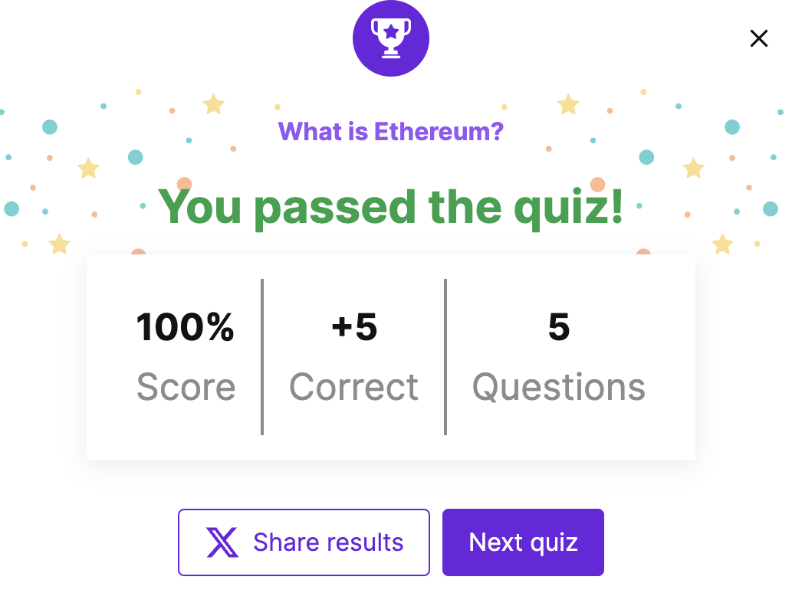

> 请在上边的 timezone 添加你的当地时区(UTC)，这会有助于你的打卡状态的自动化更新，如果没有添加，默认为北京时间 UTC+8 时区


# 你的名字

1. 自我介绍

**Dex** 对这个世界保持好奇心->想深入了解以太坊

2. 你认为你会完成本次残酷学习吗？

会的

3. 你的联系方式（推荐 Telegram）

- **Telegram**：[t.me/dexhunt3r](https://t.me/dexhunt3r)  
- **Twitter/X**：[x.com/dexhunt3r](https://x.com/dexhunt3r)  
- **farcaster**: [warpcaster.com/dexhunter.eth](https://warpcast.com/dexhunter.eth)

## Notes

<!-- Content_START -->

### 2025.03.10

先把所有资源看了一下，比如

* [油管频道eth protocol fellows](https://www.youtube.com/@ethprotocolfellows/videos)
* [wiki efp.wiki](https://epf.wiki/#/eps/intro)
* [discord](https://discord.com/invite/epfsg)
* [github repo protocol studies](https://github.com/eth-protocol-fellows/protocol-studies)
* [ethereum quizzes](https://ethereum.org/en/quizzes/) 


今天好像已经是week4了，所以需要把之前的内容过一下
* [week1](https://epf.wiki/#/eps/week1)
    * 大概介绍了下protocol, 历史和哲学
    * 以太坊协议设计
        * [技术黄皮书](https://ethereum.github.io/yellowpaper/paper.pdf)
        * 实现
        * 测试
        * 合作
* [week2](https://epf.wiki/#/eps/week2)
    * week1的链接其实直接先到week3的，不确定为啥，week3对应的是lecture2 consensus，具体看[这里](https://github.com/eth-protocol-fellows/protocol-studies/blob/main/docs/eps/week3.md)
    * 执行层
        * 区块
        * 状态机
        * jrpc信息传递
* [week3](https://epf.wiki/#/eps/week3)
    * 共识层就是PoS，具体看Casper的[论文](https://arxiv.org/pdf/2003.03052)


- *做了一下quizzes，感觉主要是夸夸以太坊*


### 2025.03.11

今天看了[week4](https://epf.wiki/#/eps/week4)的内容，主要是关于测试和安全
* 第一次知道retesteth还有个webui [这里](http://retesteth.ethdevops.io/web/)，可以测试各种不同的方法，教程在[这里](https://ethereum-tests.readthedocs.io/en/latest/retesteth-tutorial.html)，还蛮有意思的

```
Running tests using path: /data/tests
Running 1 test case...
Retesteth config path: /var/www/.retesteth
WARNING: Retesteth configs version is different (running: '0.3.2-legacy' vs config '0.3.2-cancun')!
WARNING: Update configs to the latest by deleting the folder `/var/www/.retesteth`!
Active client configurations: 't8ntool '
Checking test filler hashes for GeneralStateTests/stExample
Filter: 'accessListExample Shanghai'
Check `/data/tests/GeneralStateTests/stExample/accessListExample.json` hash
SrcFile `/data/tests/src/GeneralStateTestsFiller/stExample/accessListExampleFiller.yml`
Read json structure accessListExampleFiller.yml
Read json structure finish
Running tests for config 'Ethereum GO on StateTool' 2
Test Case "stExample": (1 of 1)
100%
Instantiated: "evm version 1.15.6-unstable-4cdd7c86-20250310"
Running accessListExample: (6995263567478450108)
Read json structure accessListExample.json
Read json finish
WARNING: Specified filter did not run a single transaction!  (GeneralStateTests/stExample/accessListExample, fork: Shanghai, TrInfo: d: -1, g: -1, v: -1)

*** No errors detected
*** Total Tests Run: 1


--------
*** TOTAL WARNINGS DETECTED: 3 warnings during all test execution!
--------
info: Retesteth configs version is different (running: '0.3.2-legacy' vs config '0.3.2-cancun')!
info: Update configs to the latest by deleting the folder `/var/www/.retesteth`!
info: Specified filter did not run a single transaction!  (GeneralStateTests/stExample/accessListExample, fork: Shanghai, TrInfo: d: -1, g: -1, v: -1) (GeneralStateTests/stExample/accessListExample, fork: Shanghai, TrInfo: d: -1, g: -1, v: -1)
```

### 2025.03.12

<!-- Content_END -->
