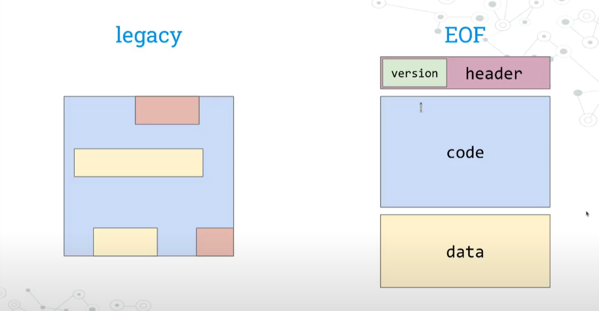

> 请在上边的 timezone 添加你的当地时区(UTC)，这会有助于你的打卡状态的自动化更新，如果没有添加，默认为北京时间 UTC+8 时区


# 你的名字

1. 自我介绍
    - Po，EthStorage Researcher
2. 你认为你会完成本次残酷学习吗？
    - 一定
3. 你的联系方式（推荐 Telegram）
    - TG: https://t.me/popopopanda
    - Twitter：https://x.com/sanemindpeace

## Notes

<!-- Content_START -->

### 2025.03.10

[学习最新的课程](https://www.youtube.com/@ethprotocolfellows/videos)

[EVM](https://www.youtube.com/watch?v=gYnx_YQS8cM)
- 目前EVM还是边解释边执行的，效率相对较低，只要是由于一些特殊的控制流很难被直接编译为机器指令
- 以太坊的gas limit 当前是31M
- EOF 解决EVM没法验证的问题

    - EIP-3540
    - 加入版本号、分离代码段和data段，便于分析和校验
    - 不需要在对指令和stack做检查了
    - control flow in EVM
        - legacy: jump的地址是从stack中读取的，dynamic很难预测
        - 变为static jump: EIP-4200/ EIP-4750
            - 除了delegate call会有一些变化
            - stack too deep从16调整为256，采用取巧的指令做的(exchange)，但是不是终极方案 

### 2025.03.11
玩了下solidity的[storage layout](https://docs.soliditylang.org/en/latest/internals/layout_in_storage.html#storage-inplace-encoding)

https://github.com/dajuguan/lab/blob/5f050d31b29a0b72857b777d9ee8e3696d088ce9/eth/contracts/test/StorageSlot.t.sol

### 2025.03.12
复习了下solidity的call,delegate call的区别，并写了代码玩了下
- call: 修改的storage是被调用合约自己的
- delegate call:  sender是调用者的account，同时调用者的storage也会被修改
    - 注意修改的是按照storage slots的相对位置，与变量名无关
    - 主要用来创建代理合约


### 2025.03.13
学习了下以太坊的DB，采用reth db可以看到目前有[哪些tables](https://github.com/paradigmxyz/reth/blob/main/docs/design/database.md)
```
 reth db --datadir ./rethdb_archive stats
```

<!-- Content_END -->
